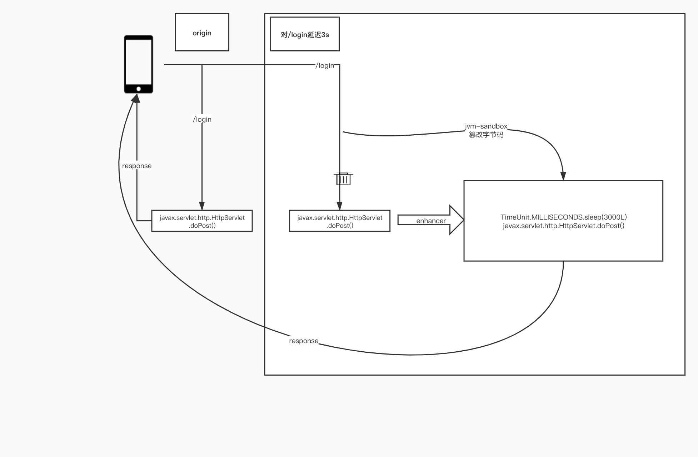

# Chaosblade-exec-jvm: Chaosblade executor for chaos experiments on Java applications


## 系统设计
Chaosblade-exec-jvm通过JavaAgent attach方式来实现类的transform注入故障，底层使用[jvm-sandbox](https://github.com/alibaba/jvm-sandbox)实现，通过插件的可拔插设计来扩展对不同java应用的支持，可以很方便的扩展插件，参考[如何扩展插件](./plugin.md)。
### 模块管理
#### SandboxModule

作为Sandbox（chaosblade）的模块、所有的Sandbox事件，如Agent挂载（模块加载）、Agent卸载（模块卸载）、模块激活、模块冻结等都会在此触发，Sandbox内置jetty容器，访问api回调到注解为@Http("/xx")的方法，来实现故障能力。

#### StatusManager

blade create 命令在StatusManager注册状态、并管理整个实验的状态，包含攻击次数、攻击的百分比、命令参数、攻击方式（Action）等。

#### ModelSpecManager

管理插件的ModelSpec，ModelSpec的注册、卸载。

#### ListenerManager

管理插件的生命周期，插件的加载、卸载。

#### RequestHandler

Sandbox内置jetty容器，访问api回调到注解为@Http("/xx")的方法，由事件分发器（DispatchService）将事件分到RequestHandler处理，RequestHandler分为如下表格（表格中的【一定条件】可以参考下面的plugin加载方式）：

|命令|RequestHandler|
|  ----  | ----  |
|blade create| CreateHandler创建一个实验，StatusManager注册状态，满足一定条件的插件加载。 |
|blade status|StatusHandler去StatusManager查询实验状态。|
|blade destroy|DestroyHandlerr销毁实验，满足一定条件的插件卸载。|
## 实现原理

以servlet，api的接口延迟为例，实现原理如下图。



### 实验步骤

下面通过命令的拆建拆解介绍每个步骤是如何实现，以servlet，api的接口延迟为例，演练实验的步骤大致如下

````shell
./blade p jvm --pid 888
{"code":200,"success":true,"result":"98e792c9a9a5dfea"}

./blade create servlet --requestpath=/topic delay --time=3000
{"code":200,"success":true,"result":"52a27bafc252beee"}

./blade destroy 52a27bafc252beee

./blade revoke 98e792c9a9a5dfea
````

### Agent挂载

````shell
./blade p jvm --pid 888
````

该命令下发后，将在目标jvm进程挂在Agent，触发SandboxModule onLoad()事件，初始化PluginLifecycleListener来管理插件的生命周期。

#### Plugin加载方式

|加载方式|加载条件|
|  ----  | ----  |
|SandboxModule onActive()事件|Pointcut、ClassMatcher、MethodMatcher都不为空|
|blade create命令CreateHandler|ModelSpect为PreCreateInjectionModelHandler类型，且ActionFlag 不为DirectlyInjectionAction类型|

SandboxModule onActive()事件，会注册ModelSpec；Plugin加载时，创建事件监听器SandboxEnhancerFactory.createAfterEventListener(plugin)，监听器会监听感兴趣的事件，如BeforeAdvice、AfterAdvice等，具体实现如下：

````java
// 加载插件
public void add(PluginBean plugin) {
        PointCut pointCut = plugin.getPointCut();
        if (pointCut == null) {
            return;
        }
        String enhancerName = plugin.getEnhancer().getClass().getSimpleName();
  			// 创建filter PointCut匹配
        Filter filter = SandboxEnhancerFactory.createFilter(enhancerName, pointCut);
   
        if (plugin.isAfterEvent()) {
          	// 事件监听
            int watcherId = moduleEventWatcher.watch(filter, SandboxEnhancerFactory.createAfterEventListener(plugin),
                Type.BEFORE, Type.RETURN);
            watchIds.put(PluginUtil.getIdentifierForAfterEvent(plugin), watcherId);
        } else {
            int watcherId = moduleEventWatcher.watch(
                filter, SandboxEnhancerFactory.createBeforeEventListener(plugin), Event.Type.BEFORE);
            watchIds.put(PluginUtil.getIdentifier(plugin), watcherId);
        }
    }
````

#### PointCut匹配

- SandboxModule onActive()事件触发Plugin加载后，SandboxEnhancerFactory创建filter，filter内部通过PointCut的ClassMatcher和MethodMatcher过滤。

#### Enhancer

如果已经加载插件，此时目标应用匹配能匹配到filter后，EventListener已经可以被触发，但是chaosblade-exec-jvm内部通过StatusManager管理状态，所以故障能力不会被触发。

例如BeforeEventListener触发调用BeforeEnhancer的beforeAdvice方法，在ManagerFactory.getStatusManager().expExists(targetName)判断时候被中断，具体的实现如下：

````java
com.alibaba.chaosblade.exec.common.aop.BeforeEnhancer

public void beforeAdvice(String targetName, 
            ClassLoader classLoader, 
            String className,
            Object object,
            Method method, 
            Object[] methodArguments) throws Exception {
  			// StatusManager 
        if (!ManagerFactory.getStatusManager().expExists(targetName)) {
            return;
        }
        EnhancerModel model = doBeforeAdvice(classLoader, className, object, method, methodArguments);
        if (model == null) {
            return;
        }
        model.setTarget(targetName).setMethod(method).setObject(object).setMethodArguments(methodArguments);
        Injector.inject(model);
    }
````

### 创建混沌实验

````shell
./blade create servlet --requestpath=/topic delay --time=3000
````
该命令下发后，触发SandboxModule @Http("/create")注解标记的方法，将事件分发给com.alibaba.chaosblade.exec.service.handler.CreateHandler处理
在判断必要的uid、target、action、model参数后调用handleInjection，handleInjection通过状态管理器注册本次实验，如果插件类型是PreCreateInjectionModelHandler的类型，将预处理一些东西。同时如果Action类型是DirectlyInjectionAction，那么将直接进行故障能力注入，如jvm oom等，如果不是那么将加载插件。

#### ModelSpec
- PreCreateInjectionModelHandler	预创建
- PreDestroyInjectionModelHandler	预销毁
#### DirectlyInjectionAction

如果ModelSpec是PreCreateInjectionModelHandler类型，且ActionSpec的类型是DirectlyInjectionAction类型，将直接进行故障能力注入，比如JvmOom故障能力，ActionSpec的类型不是DirectlyInjectionAction类型，将加载插件。


|  | DirectlyInjectionAction |Not DirectlyInjectionAction|
|  ----  | ----  | ----  |
| PreCreateInjectionModelHandler（ModelSpec） | 直接进行故障能力注入 |加载插件|
| PreDestroyInjectionModelHandler（ModelSpec） | 停止故障能力注入 |卸载插件|

````java
private Response handleInjection(String suid, Model model, ModelSpec modelSpec) {
 				// 注册
        RegisterResult result = this.statusManager.registerExp(suid, model);
        if (result.isSuccess()) {
            // handle injection
            try {
                applyPreInjectionModelHandler(suid, modelSpec, model);
            } catch (ExperimentException ex) {
                this.statusManager.removeExp(suid);
                return Response.ofFailure(Response.Code.SERVER_ERROR, ex.getMessage());
            }

            return Response.ofSuccess(model.toString());
        }
        return Response.ofFailure(Response.Code.DUPLICATE_INJECTION, "the experiment exists");
    }
````

注册成功后返回uid，如果本阶段直接进行故障能力注入了，或者自定义Enhancer advice返回null，那么后不通过Inject类触发故障。

### 故障能力注入

故障能力注入的方式，最终都是调用ActionExecutor执行故障能力。

- 通过Inject注入。
- DirectlyInjectionAction直接注入，直接注入不进过Inject类调用阶段，如果jvm oom等。

DirectlyInjectionAction直接注入不经过Enhancer参数包装匹配直接到故障触发ActionExecutor执行阶段，如果是Inject注入此时因为StatusManager已经注册了实验，当事件再次出发后ManagerFactory.getStatusManager().expExists(targetName)的判断不会被中断，继续往下走，到了自定义的Enhancer，在自定义的Enhancer里面可以拿到原方法的参数、类型等，甚至可以反射调原类型的其他方法，这样做风险较大，一般在这里往往是取一些成员变量或者get方法等，用户后续参数匹配。

#### 匹配参数包装

自定义的Enhancer，如ServletEnhancer，把一些需要与命令行匹配的参数 包装在MatcherModel里面，然后包装EnhancerModel返回，比如  --requestpath = /index，那么requestpath等于requestURI去除contextPath。参数匹配在 Injector.inject(model)阶段判断。

````java
public class ServletEnhancer extends BeforeEnhancer {

    private static final Logger LOOGER = LoggerFactory.getLogger(ServletEnhancer.class);

    @Override
    public EnhancerModel doBeforeAdvice(ClassLoader classLoader, String className, Object object,
                                        Method method, Object[] methodArguments,String targetName)
        throws Exception {
      	// 获取原方法的一些参数
        Object request = methodArguments[0];
        String queryString = ReflectUtil.invokeMethod(request, "getQueryString", new Object[] {}, false);
        String contextPath = ReflectUtil.invokeMethod(request, "getContextPath", new Object[] {}, false);
        String requestURI = ReflectUtil.invokeMethod(request, "getRequestURI", new Object[] {}, false);
        String requestMethod = ReflectUtil.invokeMethod(request, "getMethod", new Object[] {}, false);

        String requestPath = StringUtils.isBlank(contextPath) ? requestURI : requestURI.replaceFirst(contextPath, "");

      	// 
        MatcherModel matcherModel = new MatcherModel();
        matcherModel.add(ServletConstant.QUERY_STRING_KEY, queryString);
        matcherModel.add(ServletConstant.METHOD_KEY, requestMethod);
        matcherModel.add(ServletConstant.REQUEST_PATH_KEY, requestPath);
        return new EnhancerModel(classLoader, matcherModel);
    }
}
````

####  参数匹配和能力注入（Inject调用）

inject阶段首先获取StatusManager注册的实验，compare(model, enhancerModel)经常参数比对，失败后return，limitAndIncrease(statusMetric)判断 --effect-count --effect-percent来控制影响的次数和百分比

````java
public static void inject(EnhancerModel enhancerModel) throws InterruptProcessException {
        String target = enhancerModel.getTarget();
        List<StatusMetric> statusMetrics = ManagerFactory.getStatusManager().getExpByTarget(
            target);
        for (StatusMetric statusMetric : statusMetrics) {
            Model model = statusMetric.getModel();
            if (!compare(model, enhancerModel)) {
                continue;
            }
            try {
                boolean pass = limitAndIncrease(statusMetric);
                if (!pass) {
                    LOGGER.info("Limited by: {}", JSON.toJSONString(model));
                    break;
                }
                LOGGER.info("Match rule: {}", JSON.toJSONString(model));
                enhancerModel.merge(model);
                ModelSpec modelSpec = ManagerFactory.getModelSpecManager().getModelSpec(target);
                ActionSpec actionSpec = modelSpec.getActionSpec(model.getActionName());
                actionSpec.getActionExecutor().run(enhancerModel);
            } catch (InterruptProcessException e) {
                throw e;
            } catch (UnsupportedReturnTypeException e) {
                LOGGER.warn("unsupported return type for return experiment", e);
                statusMetric.decrease();
            } catch (Throwable e) {
                LOGGER.warn("inject exception", e);          
                statusMetric.decrease();
            }
            break;
        }
    }
````

#### 故障触发

由Inject触发，或者有DirectlyInjectionAction直接触发，最后调用自定义的ActionExecutor生成故障，如 DefaultDelayExecutor，此时故障能力已经生效了。

```java
public void run(EnhancerModel enhancerModel) throws Exception {
    String time = enhancerModel.getActionFlag(timeFlagSpec.getName());
    Integer sleepTimeInMillis = Integer.valueOf(time);
    int offset = 0;
    String offsetTime = enhancerModel.getActionFlag(timeOffsetFlagSpec.getName());
    if (!StringUtil.isBlank(offsetTime)) {
        offset = Integer.valueOf(offsetTime);
    }
    TimeoutExecutor timeoutExecutor = enhancerModel.getTimeoutExecutor();
    if (timeoutExecutor != null) {
        long timeoutInMillis = timeoutExecutor.getTimeoutInMillis();
        if (timeoutInMillis > 0 && timeoutInMillis < sleepTimeInMillis) {
            sleep(timeoutInMillis, 0);
            timeoutExecutor.run(enhancerModel);
            return;
        }
    }
    sleep(sleepTimeInMillis, offset);
}

public void sleep(long timeInMillis, int offsetInMillis) {
        Random random = new Random();
        int offset = 0;
        if (offsetInMillis > 0) {
            offset = random.nextInt(offsetInMillis);
        }
        if (offset % 2 == 0) {
            timeInMillis = timeInMillis + offset;
        } else {
            timeInMillis = timeInMillis - offset;
        }
        if (timeInMillis <= 0) {
            timeInMillis = offsetInMillis;
        }
        try {
          	// 触发延迟
            TimeUnit.MILLISECONDS.sleep(timeInMillis);
        } catch (InterruptedException e) {
            LOGGER.error("running delay action interrupted", e);
        }
    }
```
### 销毁实验
````shell
./blade destroy 52a27bafc252beee
````
该命令下发后，触发SandboxModule @Http("/destory")注解标记的方法，将事件分发给com.alibaba.chaosblade.exec.service.handler.DestroyHandler处理。注销本次故障的状态。

如果插件的ModelSpec是PreDestroyInjectionModelHandler类型，且ActionSpec的类型是DirectlyInjectionAction类型，停止故障能力注入，ActionSpec的类型不是DirectlyInjectionAction类型，将卸载插件。

````java
public Response handle(Request request) {
        String uid = request.getParam("suid");
        String target = request.getParam("target");
        String action = request.getParam("action");
        if (StringUtil.isBlank(uid)) {
            if (StringUtil.isBlank(target) || StringUtil.isBlank(action)) {
                return Response.ofFailure(Code.ILLEGAL_PARAMETER, "less necessary parameters, such as uid, target and"
                    + " action");
            }
            // 注销status
            return destroy(target, action);
        }
        return destroy(uid);
    }
````
### 卸载Agent
````shell
./blade revoke 98e792c9a9a5dfea
````
该命令下发后，触发SandboxModule unload()事件，同时插件卸载。

```java
public void onUnload() throws Throwable {
    LOGGER.info("unload chaosblade module");
    dispatchService.unload();
    ManagerFactory.unload();
    watchIds.clear();
    LOGGER.info("unload chaosblade module successfully");
}
```

