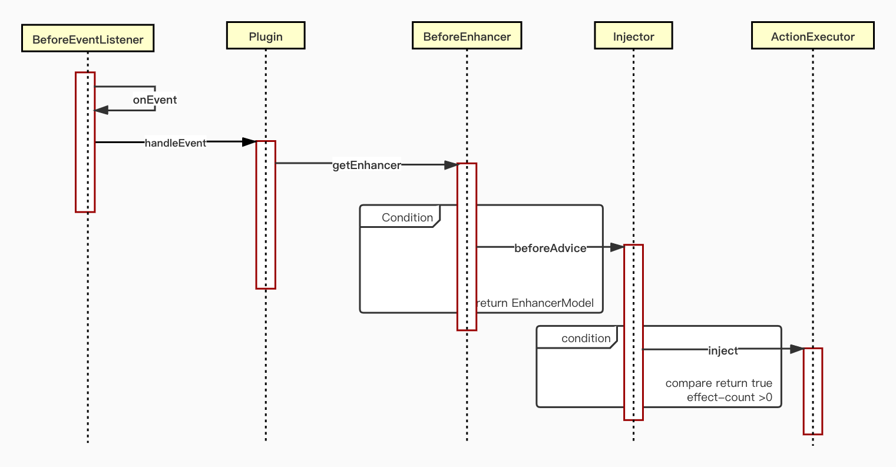
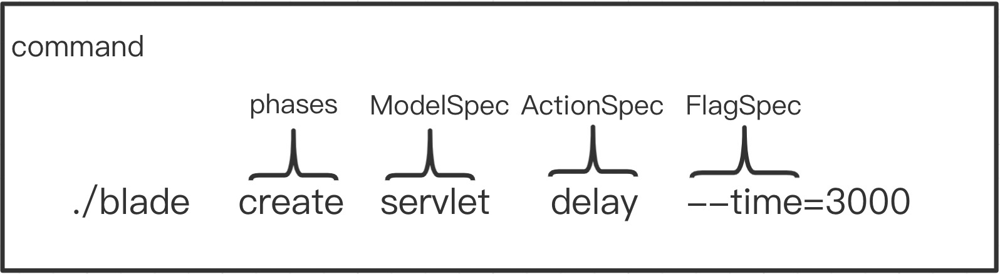
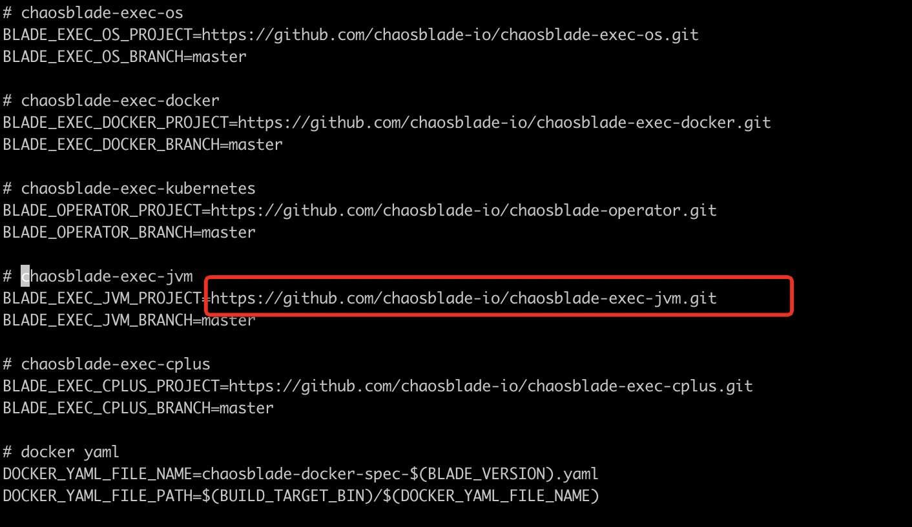

# Chaosblade-exec-jvm: Chaosblade executor for chaos experiments on Java applications

## 如何扩展一个简单的插件
## 插件的介绍
一个简单的插件包含Plugin、PointCut、Enhancer、ModelSpec、ActionSpec、ActionExecutor
## 调用插件的时序图
一个简单的插件调用的顺序图，非DirectlyInjectionAction的ActionFlag，关于DirectlyInjectionAction可参考[原理篇](./design.md)


## 插件扩展的步骤
首先 fork [chaosblade-exec-jvm](https://github.com/chaosblade-io/chaosblade-exec-jvm)
### 1、新建一个工程
在chaosblade-exec-plugin模块下新建子模块，如chaosblade-exec-plugin-servlet
### 2、自定义Enhancer

例如ServletEnhancer，获取ContextPath、RequestURI、Method等，将获取到的参数放到MatcherModel，返回EnhancerModel，Inject阶段会与输入的参数做比对。

````java
public class ServletEnhancer extends BeforeEnhancer {

    @Override
    public EnhancerModel doBeforeAdvice(ClassLoader classLoader, 
                                        String className, 
                                        Object object,
                                        Method method, 
                                        Object[] methodArguments
                                        ,String targetName) throws Exception {
        Object request = methodArguments[0];
        // 执行被增强类的方法，获取一些需要的值
        String queryString = ReflectUtil.invokeMethod(request, "getQueryString", new Object[] {}, false);
        String contextPath = ReflectUtil.invokeMethod(request, "getContextPath", new Object[] {}, false);
        String requestURI = ReflectUtil.invokeMethod(request, "getRequestURI", new Object[] {}, false);
        String requestMethod = ReflectUtil.invokeMethod(request, "getMethod", new Object[] {}, false);

        String requestPath = StringUtils.isBlank(contextPath) ? requestURI : requestURI.replaceFirst(contextPath, "");

        MatcherModel matcherModel = new MatcherModel();
        matcherModel.add(ServletConstant.QUERY_STRING_KEY, queryString);
        matcherModel.add(ServletConstant.METHOD_KEY, requestMethod);
        matcherModel.add(ServletConstant.REQUEST_PATH_KEY, requestPath);

        return new EnhancerModel(classLoader, matcherModel);
    }
}
````
需不同的通知可继承不同的类
  - beforeAdvice：继承com.alibaba.chaosblade.exec.common.aop.BeforeEnhancer
  - afterAdvice：继承com.alibaba.chaosblade.exec.common.aop.AfterEnhancer

### 3、自定义PointCut

例如ServletPointCut拦截类：spring的FrameworkServlet、webx的WebxFrameworkFilter、及父类为HttpServletBean或HttpServlet的子类。

拦截方法：doGet、doPost、doDelete、doPut、doFilter

````java
public class ServletPointCut implements PointCut {

    public static final String SPRING_FRAMEWORK_SERVLET = "org.springframework.web.servlet.FrameworkServlet";
    public static final String ALIBABA_WEBX_FRAMEWORK_FILTER = "com.alibaba.citrus.webx.servlet.WebxFrameworkFilter";
    public static final String SPRING_HTTP_SERVLET_BEAN = "org.springframework.web.servlet.HttpServletBean";
    public static final String HTTP_SERVLET = "javax.servlet.http.HttpServlet";

    public static Set<String> enhanceMethodSet = new HashSet<String>();
    public static Set<String> enhanceMethodFilterSet = new HashSet<String>();

    static {
        enhanceMethodSet.add("doGet");
        enhanceMethodSet.add("doPost");
        enhanceMethodSet.add("doDelete");
        enhanceMethodSet.add("doPut");
        enhanceMethodFilterSet.add("doFilter");
    }

    @Override
    public ClassMatcher getClassMatcher() {
        OrClassMatcher orClassMatcher = new OrClassMatcher();
        orClassMatcher.or(new NameClassMatcher(SPRING_FRAMEWORK_SERVLET)).or(
            new NameClassMatcher(ALIBABA_WEBX_FRAMEWORK_FILTER)).or(
            new SuperClassMatcher(SPRING_HTTP_SERVLET_BEAN, HTTP_SERVLET));
        return orClassMatcher;
    }

    @Override
    public MethodMatcher getMethodMatcher() {
        AndMethodMatcher andMethodMatcher = new AndMethodMatcher();
        OrMethodMatcher orMethodMatcher = new OrMethodMatcher();
        orMethodMatcher.or(new ManyNameMethodMatcher(enhanceMethodSet)).or(new ManyNameMethodMatcher
            (enhanceMethodFilterSet));
        andMethodMatcher.and(orMethodMatcher).and(new ParameterMethodMatcher(1, ParameterMethodMatcher.GREAT_THAN));
        return andMethodMatcher;
    }
}
````
  - 继承com.alibaba.chaosblade.exec.common.aop.PointCut
  - getClassMatcher：类匹配
      - SuperClassMatcher：父类名称匹配
      - OrClassMatcher：多个匹配
      - NameClassMatcher：类名匹配
  - getMethodMatcher：类方法匹配
      - ManyNameMethodMatcher：方法名集合
      - NameMethodMatcher：方法名称匹配
      - OrMethodMatcher：多个方法匹配
      - AndMethodMatcher：多条件匹配
      - ParameterMethodMatcher：参数匹配


### 4、自定义Spec
举个例子：命令[./blade create servlet delay --time=3000] 对于命令而言主要分为phases、target、action、flag，phases相对插件而言不需要很强的灵活性，因此由chaosblade-exec-service模块管理，对于自定义插件只需要扩展ModelSpec(target)、action、 flag。


#### ModelSpec

ModelSpec的getTarget()方法对于命令中target部分的名称，如servlet、dubbo等，createNewMatcherSpecs()方法添加ModelSpec下的FlagSpec，例如ServletModelSpec的getTarget()返回servlet，createNewMatcherSpecs()包含很多flagSpec，那么ModelSpec支持的命令如下：

./blade create servlet --method=post --requestpath=/index --contextpath=/shop 

--参数可任意组合。

````java
public class ServletModelSpec extends FrameworkModelSpec {

    @Override
    public String getTarget() {
        return "servlet";
    }

    @Override
    public String getShortDesc() {
        return "java servlet experiment";
    }

    @Override
    public String getLongDesc() {
        return "Java servlet experiment, support path, query string, context path and request method matcher";
    }

    @Override
    public String getExample() {
        return "servlet --requestpath /hello --method post";
    }

    @Override
    protected List<MatcherSpec> createNewMatcherSpecs() {
        ArrayList<MatcherSpec> matcherSpecs = new ArrayList<MatcherSpec>();
        matcherSpecs.add(new ServletContextPathMatcherSpec());
        matcherSpecs.add(new ServletQueryStringMatcherSpec());
        matcherSpecs.add(new ServletMethodMatcherSpec());
        matcherSpecs.add(new ServletRequestPathMatcherSpec());
        return matcherSpecs;
    }
}
````
 ModelSpec的实现方式如下：

- 实现com.alibaba.chaosblade.exec.common.model.ModelSpec
- 继承BaseModelSpec，实现了对CreateHandler阶段的输入参数的校验
- 继承FrameworkModelSpec包含DelayActionSpec、ThrowCustomExceptionActionSpec，默认实现了不同target的延迟侵入和异常侵入。

#### ActionSpec

例如DelayActionSpec，支持参数 --time=xx --offset=xx 

./blade create servlet --method=post delay --time=3000 ----offset=10

````java
public class DelayActionSpec extends BaseActionSpec {

    private static TimeFlagSpec timeFlag = new TimeFlagSpec();
    private static TimeOffsetFlagSpec offsetFlag = new TimeOffsetFlagSpec();

    public DelayActionSpec() {
      	//添加 actionExecutor
        super(new DefaultDelayExecutor(timeFlag, offsetFlag));
    }

    @Override
    public String getName() {
        return "delay";
    }

    @Override
    public String[] getAliases() {
        return new String[0];
    }

    @Override
    public String getShortDesc() {
        return "delay time";
    }

    @Override
    public String getLongDesc() {
        return "delay time...";
    }

    @Override
    public List<FlagSpec> getActionFlags() {
        return Arrays.asList(timeFlag, offsetFlag);
    }

    @Override
    public PredicateResult predicate(ActionModel actionModel) {
        if (StringUtil.isBlank(actionModel.getFlag(timeFlag.getName()))){
            return PredicateResult.fail("less time argument");
        }
        return PredicateResult.success();
    }
}
````
ActionSpec的getName()方法对应命令中action部分的名称，如delay、throwCustomExceptionde等，ActionSpec由ModelSpec的addActionSpec()方法添加，可以有以下方式实现：
- 实现com.alibaba.chaosblade.exec.common.model.action.ActionSpec

- 继承BaseActionSpec，实现了对CreateHandler阶段的输入参数的校验

#### FlagSpec 
例如TimeOffsetFlagSpec， 支持--offset=10 的参数

```java
public class TimeOffsetFlagSpec implements FlagSpec {
    @Override
    public String getName() {
        return "offset";
    }

    @Override
    public String getDesc() {
        return "delay offset for the time";
    }

    @Override
    public boolean noArgs() {
        return false;
    }

    @Override
    public boolean required() {
        return false;
    }
}
```

FlagSpec的getName()方法对应命令中flag部分的名称，如--time等
- 实现com.alibaba.chaosblade.exec.common.model.FlagSpec，由ActionSpec的getFlagSpec方法添加

- 继承com.alibaba.chaosblade.exec.common.model.matcher.MatcherSpec，由ActionSpec的addActionSpec添加，CreateHandler阶段会做参数校验

- 继承com.alibaba.chaosblade.exec.common.model.matcher.BasePredicateMatcherSpec

#### ActionExecutor
ActionExecutor执行器作为BaseActionSpec的构造参数，ActionExecutor可以自定义一些增强业务的操作，如修改方法的参数、篡改方法的返回值等。

````java
public interface ActionExecutor {

    /**
     * Run executor
     *
     * @param enhancerModel
     * @throws Exception
     */
    void run(EnhancerModel enhancerModel) throws Exception;
}
````

实现ActionExecutor的接口，EnhancerModel里面可以拿到命令行输入的参数以及原始方法的参数，类型，返回值、异常，做一些增强业务操作。

```java
// 延迟多少毫秒
Long time = Long.valueOf(enhancerModel.getActionFlag("time"));
TimeUnit.MILLISECONDS.sleep(time);
```

### 5、自定义Plugin
继承com.alibaba.chaosblade.exec.common.aop.Plugin，自定义target名称，添加Enhancer、PointCut、ModelSpec即可，实现类需要全路径名复制到 :
resources/META-INF/services/com.alibaba.chaosblade.exec.common.aop.Plugin
挂载Agent，模块激活后plugin自动加载。

```java
public class ServletPlugin implements Plugin {

    @Override
    public String getName() {
        return "servlet";
    }

    @Override
    public ModelSpec getModelSpec() {
        return new ServletModelSpec();
    }

    @Override
    public PointCut getPointCut() {
        return new ServletPointCut();
    }

    @Override
    public Enhancer getEnhancer() {
        return new ServletEnhancer();
    }
}
```
## 打包和执行
首先提交代码push到自己的仓库

### 准备
需要go环境、java_home 、maven
- clone 
````shell script
git clone https://github.com/chaosblade-io/chaosblade
````
- 修改Makefile
````shell script
cd chaosblade
vi Makefile
````
把Makefile里面的BLADE_EXEC_JVM_PROJECT改成修改成你fork的仓库地址，保存退出


- 编译
````shell script
make build_linux
````

- 挂载agent：--pid 3356 是被攻击应用的jvm进程号
每次挂载对应一个 uid，卸载agent的时候需要uid
````shell script
cd target/chaosblade-0.7.0/
./blade prepare jvm --pid 3356
````
### 混沌实验
每个实验对应一个 uid，后续的查询、销毁实验都要用到此 uid，如果遗忘了 uid，可以通过 blade status --type create 命令进行查询。 create 可以简写为 c，即 blade create 可以简写为 blade c。一个简单的例子，对servlet容器，api接口延迟3秒。

- 创建混沌实验
````shell script
./blade create servlet delay --time=3000 --requestpath=/index
````
此时访问Java应用/index应用将延迟3秒后响应。
- 销毁
````shell script
./blade create destroy 863c8c5a2c2c3deb
````
### 卸载agent
````shell script
./blade destroy 6a0863a4f0da8a38
````

