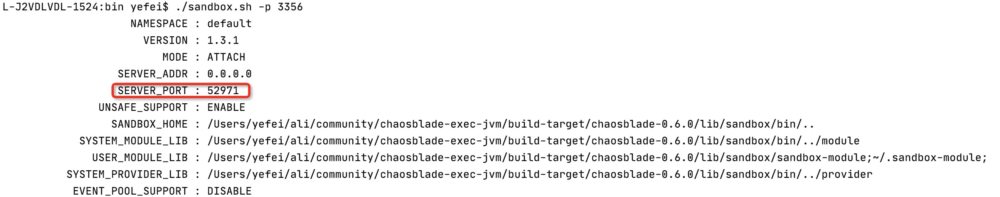

# Chaosblade-exec-jvm: Chaosblade executor for chaos experiments on Java applications
## 介绍
该项目是一个基于jvm-sandbox的chaosblade执行器，用于通过增强类对Java应用程序进行混沌实验。

## 快速入门-blade
有关详细信息，请参阅[chaosblade](https://github.com/chaosblade-io/chaosblade)项目，及chaosblade[帮助文档](https://chaosblade-io.gitbook.io/chaosblade-help-zh-cn/blade-prepare-jvm)。
### 准备
需要go环境、java_home 、maven
- clone 
````shell script
git clone https://github.com/chaosblade-io/chaosblade
````
- 编译
````shell script
cd chaosblade
make build_linux
````

- 挂载agent：--pid 3356 是被攻击应用的jvm进程号
每次挂载对应一个 uid，卸载agent的时候需要uid
````shell script
cd target/chaosblade-0.7.0/
blade prepare jvm --pid 3356
````
### 混沌实验
每个实验对应一个 uid，后续的查询、销毁实验都要用到此 uid，如果遗忘了 uid，可以通过 blade status --type create 命令进行查询。 create 可以简写为 c，即 blade create 可以简写为 blade c。一个简单的例子，对servlet容器，api接口延迟3秒。

- 创建混沌实验
````shell script
./blade create servlet delay --time=3000 --requestpath=/index
````
此时访问Java应用/index应用将延迟3秒后响应。
- 销毁
````shell script
./blade create destroy 863c8c5a2c2c3deb
````
销毁后实验就就结束了，此时访问Java应用/index恢复正常，这里这是一个对，对servlet容器，api接口延迟3秒的实验，还有其他dubbo接口延迟、druid线程池满、篡改指定方法的参数及返回值等可以参考chaosblade[帮助文档](https://chaosblade-io.gitbook.io/chaosblade-help-zh-cn/blade-prepare-jvm)。
### 卸载agent
````shell script
./blade destroy 6a0863a4f0da8a38
````

## 快速入门-sandbox
./blade底层依赖sandbox，下面介绍直接通过sandbox来实现演练，如果已经克隆本项目，直接从编译阶段开始即可。
### 准备
- clone
````shell script
git clone https://github.com/chaosblade-io/chaosblade-exec-jvm
````
- 编译
````shell script
cd chaosblade-exec-jvm
make build
````
- 挂载agent： -p 3356 是被攻击应用的jvm进程号
````shell script
cd ./build-target/chaosblade-0.7.0/lib/sandbox/bin/ && ./sandbox.sh -p 3356
````
- 激活模块
````shell script
./sandbox.sh -p 3356 -a chaosblade
````
### 混沌实验
此阶段可反复侵入和销毁，suid为一次实验的上下文唯一， 一个简单的例子，对servlet容器，api接口延迟3秒

- 创建混沌实验
````shell script
curl -X post http://127.0.0.1:52971/sandbox/default/module/http/chaosblade/create -H 'Content-Type:application/json' -d '{"action":"delay","target":"servlet","suid":"110","time":"3000","requestpath":"/hello"}'
````
此时访问Java应用/index应用将延迟3秒后响应，http://127.0.0.1:49698 端口在挂载agent返回，如下图


- 销毁
````shell script
curl -X post http://127.0.0.1:52971/sandbox/default/module/http/chaosblade/destroy -H 'Content-Type:application/json' -d '{"action":"delay","target":"servlet","suid":"110"}'
````
### 卸载
- 卸载agent
````shell script
./sandbox.sh -p 3356 -S
````